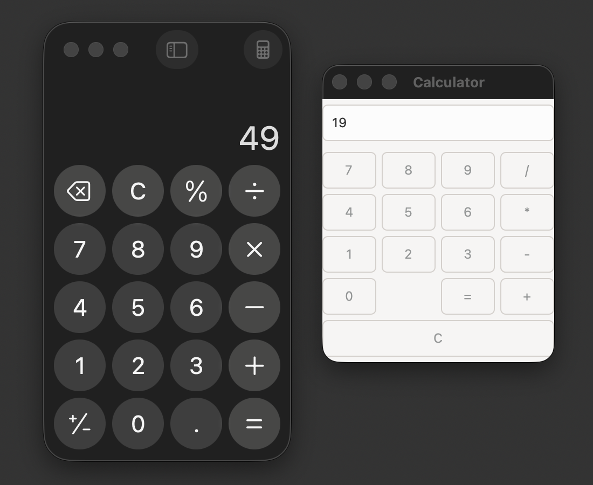
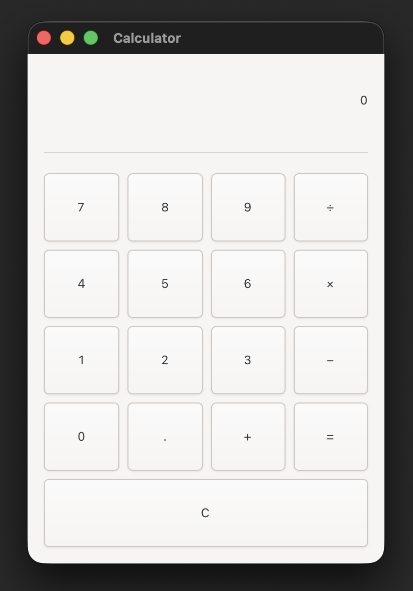
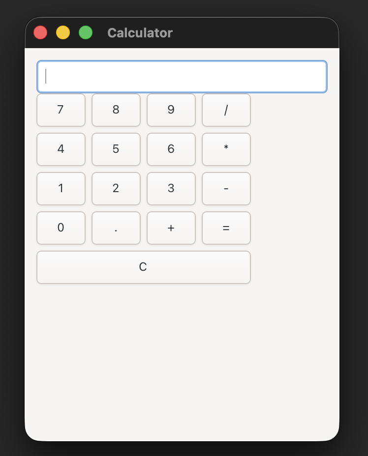

# calculator



| New | Old |
|-----|-----|
|  |  |

You are free to use, modify, and distribute this project.

I'll use haskell-gi with GTK4.

# Check if GHC and Cabal are installed
$ which ghc && ghc --version && which cabal

On macOS, the easiest way is to use ghcup. Let me install GHC using ghcup.

# Check if Homebrew is installed
$ which brew
/opt/homebrew/bin/brew

1. First install GHC (Glasgow Haskell Compiler) - likely using ghcup or homebrew
2. Then create the GTK application

# Check if ghcup is installed
$ which ghcup
ghcup not found

# Install GHC, cabal, GTK4 and dependencies

```
$ brew install ghc cabal-install gtk4 gobject-introspection
==> Auto-updating Homebrew...
Adjust how often this is run with `$HOMEBREW_AUTO_UPDATE_SECS` or disable this behaviour by setting `HOMEBREW_NO_INSTALL_CLEANUP=1`. Hide these hints by setting `HOMEBREW_NO_ENV_HINTS=1` (see `man brew`).
==> Auto-updated Homebrew!
Updated 2 taps (homebrew/core and homebrew/cask).
==> New Formulae
copilot-language-server: Terminal-based AI coding assistant
nextpnr-ice40: Portable FPGA place and route tool for Lattice iCE40
opentimestamps-client: Create and verify OpenTimestamps proofs
proxelar: Minimal HTTP/HTTPS pastebin
==> New Casks
claude-code@latest: Terminal-based AI coding assistant
font-bj-cree
font-saira-stencil
jiba: Apple Music metadata localisation tool
proton-meet: Desktop client for Proton Meet
wallspace: Live wallpaper

You have 30 outdated formulae and 2 outdated casks installed.

==> Fetching downloads for: ghc and cabal-install
✔︎ Bottle Manifest ghc (9.14.1)
✔︎ Bottle Manifest cabal-install (3.16.1.0)
✔︎ Bottle cabal-install (3.16.1.0)
✔︎ Bottle ghc (9.14.1)
==> Pouring ghc--9.14.1.arm64_tahoe.bottle.tar.gz
==> /opt/homebrew/Cellar/ghc/9.14.1/bin/ghc-pkg recache
🍺  /opt/homebrew/Cellar/ghc/9.14.1: 9,400 files, 2.2GB
==> Running `brew cleanup ghc`...
Disable this behaviour by setting `HOMEBREW_NO_INSTALL_CLEANUP=1`.
Hide these hints by setting `HOMEBREW_NO_ENV_HINTS=1` (see `man brew`).
==> Pouring cabal-install--3.16.1.0.arm64_tahoe.bottle.1.tar.gz
🍺  /opt/homebrew/Cellar/cabal-install/3.16.1.0: 8 files, 97.9MB
==> Running `brew cleanup cabal-install`...
```

The executable is ready at `dist-newstyle/.../hello-gtk.`

To run:

```
cabal run hello-gtk
```

Or create an app bundle for macOS:
```
./scripts/create-bundle.sh
open Calculator.app
```

Or run the binary directly:

```
$(cabal list-bin hello-gtk)
```
